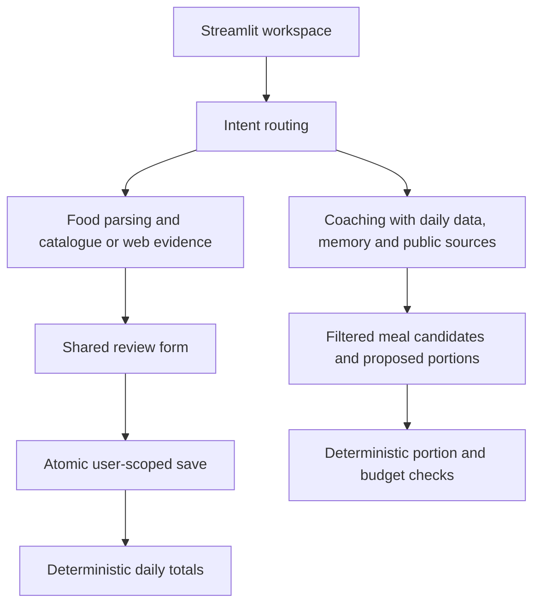

# CalorieCoach

A local Streamlit nutrition workspace for recording meals, reviewing estimates, tracking trends, and getting AI coaching based on deterministic daily totals.

CalorieCoach provides general adult nutrition estimates and habit support. It does not diagnose, treat, or replace professional medical advice.

## Run locally

Use Python 3.11 or newer:

```powershell
py -3.11 -m venv .venv
.\.venv\Scripts\Activate.ps1
python -m pip install -r requirements.txt
Copy-Item .env.example .env
streamlit run app.py
```

An OpenAI key is optional. Without it, profiles, custom targets, manual logging, demo data, progress charts, deterministic daily summaries, and the local catalogue MCP tools work. AI text parsing, coaching, web extraction, and meal proposals require a configured key and a network connection.

Configure `OPENAI_API_KEY`, `OPENAI_MODEL`, and optionally `OPENAI_EMBEDDING_MODEL` in `.env`. AI clients are initialized only when called. Structured responses use `store=False`. Logs record stage duration and token usage without logging prompt bodies.

## Workspace and food flow

1. Enter a username in the sidebar.
2. Complete a profile, or load the two-week demo into an unused username.
3. Enter known nutrition manually, or ask the assistant / nutrition lookup to prepare an estimate.
4. Review the dish, reference portion, nutrients, date, and meal type.
5. Confirm and save. Unresolved foods are listed individually; partial saving requires explicit acknowledgement.
6. View updated totals and trends, or request a next-meal suggestion.

Both AI entry points use the same confirmation component. Chat never writes food logs directly. A mixed request such as “I had chicken rice for lunch — what should I eat for dinner?” prepares the consumed meal first and retains the question for after confirmation.

A draft keeps its original description, owner, and submission ID. Changing the input textbox does not relabel an older estimate. Switching usernames clears draft, assistant, trend, and widget state. Duplicate submissions are reserved by a unique `user_id + request_id` database constraint; a changed payload cannot reuse an old submission ID.

**Local access model:** usernames identify workspaces; they are not authentication. This mode is intended for a local demo or personal installation. Public deployment requires a separate authentication and authorization design.

## Portions and source quality

- Matching units scale deterministically: grams/kilograms, millilitres/litres, matching count units, and fractions or multiples of a reference serving.
- Mass and volume are never converted using an assumed density.
- Unknown portions and incompatible units require user review. Reference nutrition is displayed with an explanation rather than being presented as a measured estimate.
- The bundled `data/food_300.xlsx` has a mixed “g/ml” heading without per-row units. Its units are recorded as unverified. A future catalogue can supply a `Serving Unit` column; the current importer does not silently assume grams.
- Catalogue records retain their file name, SHA-256 version, and source quality. Unknown origin/region and dietary tags are not invented. Existing catalogue macros and saved food-log values are preserved during upgrades.
- Food-name match confidence, portion status, and nutrition source quality are separate. Confirmed logs retain original estimates and available evidence metadata.
- Web fallback extracts from supplied search snippets, not fetched full nutrition pages. Unsupported fields remain missing. Canonical URLs are deduplicated; confidence also depends on distinct source websites. Agreement does not prove the underlying nutrition is correct.

## Meal recommendations and dietary constraints

The next-meal budget is separate from the whole day's remaining budget. The current transparent planning heuristic caps breakfast at 25%, lunch/dinner at 35%, and snacks at 10% of daily targets, also bounded by the remaining amount. When a meal is not named, logged meal types guide which meal is next. These are planning defaults, not clinical prescriptions.

The planner receives recent foods, the user goal, and structured dietary constraints. It may choose only retrieved food IDs. Portions and nutrients are calculated by code; a plan is returned only if it passes the configured budget checks. Two failed proposals produce a visible explanation and general coaching, rather than an unchecked meal.

Dietary restrictions are never dropped to make room for recent preferences. Automatically detected restrictions and diet preferences appear in Profile for confirmation. The complete allergen statement is retained.

The current catalogue lacks reviewed ingredient lists. Food names cannot establish allergen safety. Allergy/ingredient-avoidance requests therefore do not receive a supposedly verified local meal. Vegetarian/vegan and similar choices require reviewed `dietary_tags`; unknown tags fail the filter.

Restaurant discovery supports official Singapore domains for KFC and McDonald's. These results are menu information only: no verified nutrition or dietary suitability, no budget comparison, and no automatic logging.

## Knowledge and memory

The shared public-guidance corpus uses source-linked WHO, WHO/FAO, Singapore HPB, and SFA starter passages. Starting the app seeds those passages locally without network or embedding requests.

Profile → **Nutrition knowledge base** → **Refresh authoritative web sources** downloads and indexes public guidance. Embeddings are prepared before opening a write transaction. Failed downloads retain existing content. When embeddings are unavailable, retrieval falls back to keyword scoring and preserves source URLs. Refresh can retry missing vectors even if a webpage's text has not changed.

The corpus supports general coaching only. Profiles, food logs, portions, and daily totals remain the source of truth for personal nutrition. Source links identify retrieved context, not an independently audited guarantee of every generated sentence.

Memory stores recent messages, a bounded summary, and reviewable preferences. It is always scoped by user. Profile lets users add, confirm, and remove memories; removing memory does not delete food or weight records.

## Database and upgrades

SQLite is the supported database. The default file is `caloriecoach.db`; `DATABASE_URL` can point to another SQLite file.

Initialization runs once per engine in a process. The versioned upgrade preserves older single-user data in the `legacy` workspace and adds provenance, submission, and confirmation fields. Before upgrading an existing unversioned database, it creates a sibling `*.pre-v1-<timestamp>.db` backup. Backups and local databases must remain private.

Fresh tables use foreign keys. Legacy user-owned tables also receive owner-validation triggers without rebuilding food histories. Services reject writes without an existing owner, and unscoped reads return no personal data. Weight uniqueness is per user and day.

| Data | Ownership / purpose |
| --- | --- |
| `user_profiles` | Username, body data, targets |
| `food_logs`, `weight_entries` | User-owned nutrition and weight records |
| `meal_submissions` | Atomic per-user duplicate-submission protection |
| `conversation_messages`, `conversation_sessions`, `user_memories` | User-owned conversational context |
| `foods` | Shared reference nutrition and provenance |
| `knowledge_sources`, `knowledge_chunks` | Shared public-guidance passages and optional vectors |
| `schema_migrations` | Applied local schema version |

## Architecture



- `app.py`: workspace composition, dashboard, and food-log controls.
- `utils/profile_ui.py`, `utils/assistant_ui.py`, `utils/food_review_ui.py`: focused UI components.
- `services/food_review_service.py`: draft identity and validated review contract.
- `services/portion_calculator.py`: unit normalization and deterministic scaling.
- `services/meal_budget_service.py`, `services/dietary_constraints.py`: explicit planning policy.
- `services/nutrition_orchestrator.py`: readable routing workflow; no chat-side persistence.
- `database/`: models, startup migration, transactions, and catalogue import.
- `ai/`: prompts and lazy Responses API clients.

## Read-only catalogue MCP

Run from the project root:

```powershell
.\.venv\Scripts\python.exe -m mcp_server.nutrition_server
```

The historical direct-script command is also supported. The tools expose shared catalogue data only, never personal logs, profiles, or memory:

- `search_local_food(query)`
- `lookup_food_nutrition(query, quantity=None, unit=None)`

Results state whether the portion was scaled and whether review is required. A catalogue match does not establish exact nutrition or allergen safety.

## Tests

```powershell
python -m unittest discover -s tests -v
python -m pip check
```

Tests use isolated databases and mocked providers. They cover unit conversions, intent routing, shared confirmation, missing-key startup, user switching, duplicate evidence, dietary constraints, embedding fallback, concurrent submissions, and legacy migrations. They do not modify the user's saved database or call paid AI services.

GitHub Actions runs the suite on Python 3.11 and 3.13. External provider availability and real answer quality still require separate integration evaluation.
