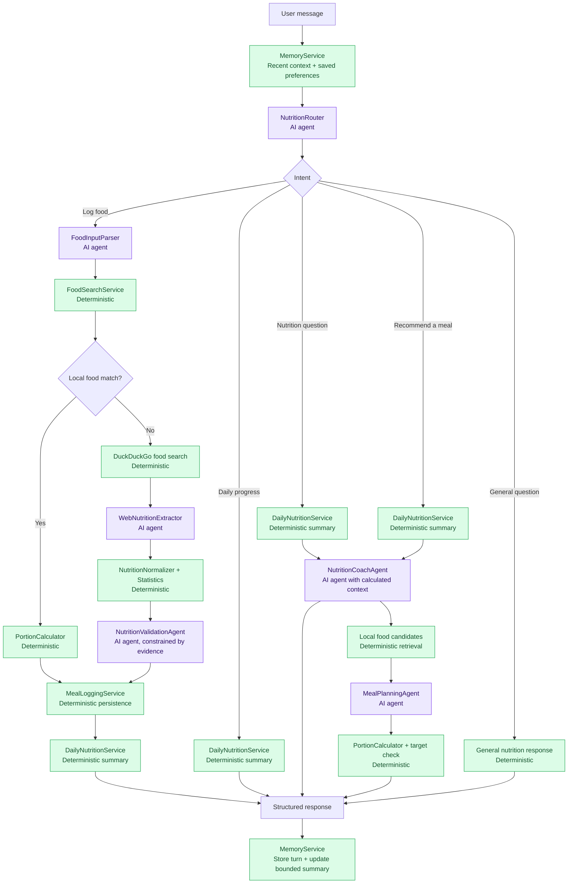

# CalorieCoach

A local nutrition-tracking application built with Streamlit. It helps users log meals, estimate calories and macronutrients, review food and weight trends, and receive AI guidance grounded in the day's actual intake.

> CalorieCoach provides general adult nutrition estimates and habit support. It does not diagnose, treat, or replace professional medical advice.

## Features

- **Username workspaces**: Each username has its own profile, food logs, weight entries, and AI context. No password is required, making this suitable for local household or classroom demos.
- **Personal targets**: Calculates BMR, TDEE, calories, and macro targets from a user's profile, with support for complete custom targets.
- **Food logging**: Add meals manually, review AI results before saving, and edit or delete saved records.
- **Nutrition lookup**: Searches the bundled food catalogue first, then falls back to web evidence extraction and validation when necessary.
- **Explainable estimates**: Source URLs, validation status, confidence, and user-review markers remain attached to saved logs.
- **Daily progress and AI coaching**: Database services calculate daily totals; the AI receives those deterministic totals as context for guidance.
- **Assistant memory**: A user-scoped recent conversation window, bounded session summary, and reviewable long-term food preferences/constraints make follow-up coaching more useful without treating AI memory as nutrition fact.
- **Citable nutrition RAG**: A shared, reviewable knowledge base retrieves relevant passages from curated WHO, WHO/FAO, Singapore HPB, and SFA public-health sources for coaching answers. The source URL is shown with each response.
- **Progress page**: Shows 7-, 30-, and 90-day calorie, protein, and weight trends.
- **AI meal recommendations**: The homepage assistant suggests a next meal from today's remaining nutrition budget. Suggestions are never logged automatically.
- **Demo data**: A new username can load a 14-day sample history containing 42 meal logs and 5 weight entries.

## Quick start

### 1. Install dependencies

```powershell
py -3.11 -m venv .venv
.\.venv\Scripts\Activate.ps1
pip install -r requirements.txt
```

### 2. Configure OpenAI (optional)

```powershell
Copy-Item .env.example .env
```

Add an OpenAI API key to `.env`:

```env
OPENAI_API_KEY=your_openai_api_key
OPENAI_MODEL=gpt-6-astra
OPENAI_EMBEDDING_MODEL=text-embedding-3-small
```

Without an API key, manual logging, the local food catalogue, progress tracking, and demo data remain available. AI parsing, coaching, web nutrition extraction, meal recommendations, and trend analysis require a valid key and network connection.

The knowledge base always has a small local, source-linked starter set. In **Profile → Nutrition knowledge base**, choose **Refresh authoritative web sources** to download and index the current public guidance. With an OpenAI key, chunks and queries use `text-embedding-3-small`; without one, the same source-linked corpus remains available through a keyword fallback.

### 3. Run the app

```powershell
streamlit run app.py
```

On first launch, the application creates `caloriecoach.db` locally and seeds the food catalogue from `data/food_300.xlsx`.

## User flow

```text
Enter a username
    ↓
New user: complete a profile or load demo data
Existing user: load that username's profile and history
    ↓
Log food manually or use AI lookup → review/edit the estimate → save
    ↓
Calculate user-scoped daily totals → dashboard, progress page, and AI coach
    ↓
Ask a follow-up question → recent conversation context and saved preferences inform the response
```

### Loading demo data

1. Enter an unused username in the sidebar, such as `demo-user`.
2. Select **Load demo data**.
3. Open the Progress page to inspect two weeks of food and weight history.

Demo data can only be loaded into a username without a profile. This prevents repeated loads from duplicating or overwriting real records. Use a different username to create another demo workspace.

## Project structure

```text
CalorieCoach/
├── app.py                         # Main dashboard, username workspace, logs, coach, assistant
├── pages/
│   ├── Progress.py                 # Food/weight trends and history
├── database/
│   ├── models.py                   # UserProfile, FoodLog, WeightEntry, Food ORM models
│   ├── database.py                 # SQLite engine, transactions, additive migrations
│   └── food_seed.py                # Imports the bundled Excel food catalogue
├── mcp_server/
│   └── nutrition_server.py          # Read-only MCP entry point for the shared food catalogue
├── services/
│   ├── knowledge_base_service.py  # Curated-source ingestion, chunking, embedding, retrieval, and citations
│   ├── memory_service.py           # User-scoped conversation window, summary, and reviewable preferences
│   ├── nutrition_service.py        # Profile, targets, and user-scoped daily totals
│   ├── meal_service.py             # User-scoped food/weight CRUD and progress queries
│   ├── meal_logging_service.py     # Atomic persistence of validated food estimates
│   ├── demo_data_service.py        # Safe two-week demo-history generator
│   ├── nutrition_mcp_tools.py       # Read-only tool implementations used by the MCP server
│   ├── food_* / web_*              # Food parsing, search, and web nutrition evidence extraction
│   ├── nutrition_*                 # Routing, validation, statistics, coaching, orchestration
│   ├── portion_calculator.py       # Deterministic serving calculations
│   └── meal_planning_*.py          # Local candidate selection and meal recommendation
├── ai/
│   ├── prompts.py                  # Auditable AI prompts
│   ├── openai_client.py             # OpenAI Responses API structured-output adapter
│   └── nutrition_ai.py              # OpenAI Responses API text client
├── utils/
│   ├── helpers.py                  # Dashboard metrics and progress bars
│   └── ui.py                       # Shared visual theme, headers, and empty states
├── data/food_300.xlsx              # Initial local food catalogue
└── tests/                          # Pipeline, logging, coaching, router, and memory tests
```

## Architecture

## Agent orchestration flow

The V1 Assistant sends each free-text request through `NutritionOrchestrator`. Purple nodes are AI agents; green nodes are deterministic services that calculate, validate, retrieve, or persist data.



### Local Nutrition MCP Server

CalorieCoach includes a small, read-only MCP server for the shared local food catalogue. It deliberately does not expose personal profiles, food logs, weight entries, or any write operation.

| Tool | Purpose |
| --- | --- |
| `search_local_food(query)` | Find the best catalogue match and its typical-serving nutrition. |
| `lookup_food_nutrition(query, quantity, unit)` | Match a food name and return nutrition in one call; grams scale the portion. |

`lookup_food_nutrition` is the preferred tool for AI agents. It accepts a food name directly, so agents do **not** need to search for or retain an internal `food_id` first.

```text
lookup_food_nutrition(
  query="Hainanese chicken rice",
  quantity=250,
  unit="g"
)
```

The result includes the matched catalogue food, serving size, calories, protein, carbohydrates, fat, source, and whether the quantity was scaled. When no reliable local match exists, it returns `found: false` instead of inventing nutrition data.

Run it over the local stdio transport:

```powershell
.\.venv\Scripts\python.exe mcp_server\nutrition_server.py
```

The server is intentionally independent from the Streamlit UI, so a future `NutritionMcpProvider` can call it as an external fallback without exposing user data.

### Database sources and provenance

`caloriecoach.db` is a local SQLite database created on first launch. Its tables have different sources and should not be treated as interchangeable:

| Database data | Source | How it is used |
| --- | --- | --- |
| `foods` | Bundled [data/food_300.xlsx](data/food_300.xlsx) seed catalogue | First-choice lookup for food estimates and portion scaling. |
| `food_logs`, `weight_entries`, `user_profiles` | Data entered or confirmed by the active local user | The sole source for that user's targets, history, and deterministic daily totals. |
| `conversation_*`, `user_memories` | Active user's assistant conversation and reviewable saved preferences | Context only; never used as nutrition facts or shared with another user. |
| `knowledge_sources`, `knowledge_chunks` | Curated public-health webpages: WHO, WHO/FAO, Singapore HPB, and SFA; each record keeps its original URL and refresh time | General nutrition RAG context with visible citations; never used to calculate calories or macros. |
| Web-derived food entries | DuckDuckGo result URLs plus extraction and validation metadata retained on the saved `food_logs` record | Fallback only when the bundled food catalogue has no reliable match; users review before saving. |

The database is local by default and `caloriecoach.db` is excluded from Git. A username scopes personal tables but is not authentication; do not use this demo-style setup for public or sensitive-health deployments.

### User workspaces and data isolation

`UserProfile.username` identifies a local user workspace. `FoodLog.user_id` and `WeightEntry.user_id` reference that profile, so food logs and weight data are queried and modified only within the active workspace.

When an older single-user database is upgraded, its existing records are retained in the `legacy` workspace. `caloriecoach.db` is ignored by Git, so forks and clones do not include any local user data.

**Privacy boundary:** a username is not authentication. Anyone who knows a username can enter that workspace. Do not use this mode for public deployment or sensitive health data; production use requires authentication and proper access control.

### Assistant memory

Assistant memory improves follow-up questions such as “what about dinner?” while keeping nutrition records separate from conversational context.

- **Short-term memory** keeps the latest eight messages for the active assistant session. Once that window is exceeded, the older portion is stored as a bounded session summary.
- **Long-term memory** stores only user-scoped preferences, restrictions, routines, goal context, and communication preferences. It can be created manually from **Profile → Assistant memory** or captured from clear, durable statements in a conversation.
- **Review and deletion** are available in the Profile tab. Removing a memory does not change food logs, weight entries, profile targets, or previous assistant messages.
- **Nutrition facts remain deterministic.** Profile fields, food logs, daily totals, and meal calculations remain the source of truth; the model only interprets that data together with the small relevant memory context.

Each assistant turn is stored only after a profile exists, and every message, summary, and saved memory is filtered by the active `user_id`. A new browser session starts a new short-term conversation window, while approved long-term memories remain available to that user's workspace.

### Food analysis and evidence validation

```text
User description
  → FoodInputParser: extracts food items and explicitly stated portions only
  → FoodSearchService: searches the local food catalogue
  → Match found: PortionCalculator scales the nutrition values
  → No match: DuckDuckGo search → OpenAI extracts facts from supplied search evidence
  → NutritionNormalizer + NutritionStatistics: normalize servings and exclude outliers
  → NutritionValidationAgent: accepts, marks uncertain, or rejects based on evidence
  → User reviews/edits the result → MealLoggingService saves provenance and status
```

The AI does not perform final aggregation, serving arithmetic, or database writes. Deterministic services handle those responsibilities. User-adjusted estimates are marked as `user_reviewed` while their original source metadata remains available.

### Constrained local food matching

For a non-exact food name, CalorieCoach retrieves a small set of local catalogue candidates before asking a structured-output model to choose one candidate ID or return no match. Explicit cooking methods are hard constraints: for example, `steamed chicken rice` cannot retrieve or select `roasted`, `fried`, or `grilled` chicken rice. The model never receives or generates nutrition values, and the server rejects any ID outside the retrieved candidates. Only a high-confidence candidate is used automatically; otherwise the existing web-evidence path is used. This keeps the local catalogue as the sole source for locally matched calories and macros.

### Daily summaries, coaching, and meal recommendations

```text
FoodLog for the active user
  → NutritionService.daily_totals()
  → DailyNutritionService.summary()
  → consumed / target / remaining calories and macros
  ├── Dashboard and Progress page
  ├── NutritionCoachService: AI interprets deterministic data plus a bounded memory context
  └── MealPlanningService: chooses local Food candidates and calculates nutrition deterministically
```

`NutritionOrchestrator` powers the V1 assistant by loading the active user's memory context, routing requests to food logging, daily progress, coaching, meal recommendations, or general guidance, then saving the completed turn. Paths that read or write user data receive the active user's service instances.

### Nutrition knowledge retrieval (RAG)

The knowledge base is shared public guidance, not a user profile or source of calorie values. It has six curated starter sources (WHO, WHO/FAO, Singapore HPB, and SFA) and can refresh their current webpage text from the Profile tab. On refresh it extracts readable content, creates overlapping chunks, stores each chunk with its source metadata, and embeds it using OpenAI when configured. At question time, it embeds the question, ranks chunks by cosine similarity, and injects the highest-scoring excerpts into the nutrition coach context. When embeddings are unavailable, it uses lexical ranking and preserves the same source links.

Only the selected excerpts may support general guidance. Profile targets, food logs, portions, and daily macro totals are still calculated by deterministic services and are never supplied by the RAG corpus. The UI lists the retrieved source links, and failed refreshes preserve the last successfully indexed text.

### Restaurant requests

Restaurant names such as KFC are not silently matched to an unrelated food in the local catalogue. The meal planner first looks for verified local menu nutrition. When that catalogue has no verified match, a separate search agent queries official Singapore restaurant pages and an LLM extracts only menu names supported by those pages. Those results are labelled **Official menu only**: they have no calories/macros, are not compared against the user's remaining budget, cannot be logged, and are never added to the local database. If the official search cannot return a supported item, the app also shows an LLM-generated general ordering strategy based on the user's remaining budget. It is explicitly labelled non-official, has no restaurant-item or nutrition claims, and is not loggable.

## Data model

| Table | Purpose | Ownership |
| --- | --- | --- |
| `user_profiles` | Username, body data, goals, and custom targets | Unique `username` |
| `food_logs` | Individual food entries, nutrients, sources, and validation metadata | `user_id → user_profiles.id` |
| `weight_entries` | Daily weight and notes | Unique `user_id + recorded_on` |
| `foods` | Shared local food catalogue | Not user-owned |
| `conversation_messages` | User and assistant messages for the current short-term context window | `user_id → user_profiles.id` |
| `conversation_sessions` | Bounded summary of older messages in a conversation session | `user_id → user_profiles.id` |
| `user_memories` | Reviewable preferences, constraints, routines, goals, and communication style | `user_id → user_profiles.id` |
| `knowledge_sources` | Curated public-health source metadata and refresh state | Shared, read-only corpus |
| `knowledge_chunks` | Citable text passages and optional embeddings | `source_id → knowledge_sources.id` |
